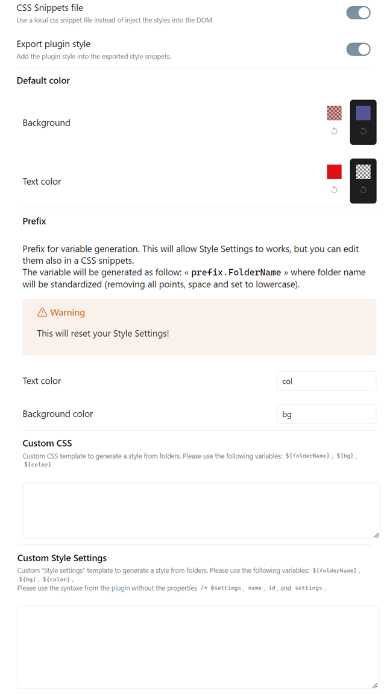

# Simple Colored Folder

Automagically add color to roots folders, and customize them with Style Settings.

## 📦 Features

- Automatically applies variables & colors to root-level folders in your vault
- Customizable colors for each folder through style settings
- Custom styling options through template
- Folder style changes update in real-time
- Supports both light & dark themes
- Support for renaming folder while keeping styling

> [!warning]
> This plugin requires the [Style Settings](https://github.com/mgmeyers/obsidian-style-settings) plugin to customize folder colors. You'll see a warning if Style Settings isn't installed.

## ⚙️ Usage

1. Install the plugin
2. Make sure you also have the [Style Settings](https://github.com/mgmeyers/obsidian-style-settings) installed & enabled.
3. Access Style settings to customize your folder color.
4. Under the "Simple Colored folder" section, you can change colors for each root folder.

## 🎨 Configuration

In the plugin settings, you can customize :
- Export to a css snippets (instead of inject into the DOM)
- Default colors (when creating new folders)
- Folder name prefix for CSS varaible
- Custom CSS templates
- Custom style settings template

> [!NOTE]
> You can see some example of css template [here](./docs/snippets.md)

## 📥 Installation

- [ ] From Obsidian's community plugins
- [x] Using BRAT with `https://github.com/Mara-Li/obsidian-simple-colored-folder`
- [x] From the release page: 
    - Download the latest release
    - Unzip `simple-colored-folder.zip` in `.obsidian/plugins/` path
    - In Obsidian settings, reload the plugin
    - Enable the plugin

### 🎼 Languages

- [x] English
- [x] French

To add a translation:
1. Fork the repository
2. Add the translation in the `src/i18n/locales` folder with the name of the language (ex: `fr.json`). 
    - You can get your locale language from Obsidian using [obsidian translation](https://github.com/obsidianmd/obsidian-translations) or using the commands (in templater for example) : `<% tp.obsidian.moment.locale() %>`
    - Copy the content of the [`en.json`](./src/i18n/locales/en.json) file in the new file
    - Translate the content
3. Edit `i18n/i18next.ts` :
    - Add `import * as <lang> from "./locales/<lang>.json";`
    - Edit the `ressource` part with adding : `<lang> : {translation: <lang>}`

