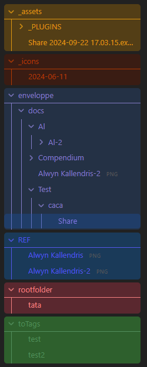
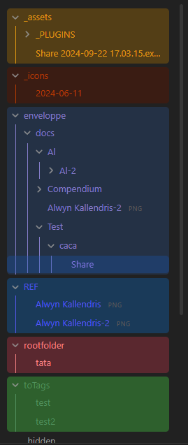

# Border color



Add this if in the template CSS part to apply the color to the folder collapse icon and the border bottom of the folder.

```css
.tree-item-self.nav-folder-title[data-path^="${folderName}"] .collapse-icon svg.svg-icon {
  --nav-collapse-icon-color: var(${color});
}

.nav-files-container.node-insert-event>div>.tree-item.nav-folder>.tree-item-self.nav-folder-title[data-path="${folderName}"] {
  border-bottom: 1px solid var(${color});
  border-radius: 0;
}
```

To remove the border when collapsed, add just this in a separate CSS snippet:

```css
.nav-files-container.node-insert-event>div>.tree-item.nav-folder.is-collapsed>.tree-item-self.nav-folder-title {
  border-bottom: 0;
}
```

# Indentation colors



```css
.tree-item.nav-folder[data-path="${folderName}"] {
    --nav-indentation-guide-color: var(${color});
}
```

# Adjust hovering and is active colors

```css
.nav-file-title[class*="is-active"][data-path^="${folderName}"],
.nav-folder-title[data-path^="${folderName}"]:hover,
.nav-file-title[data-path^="${folderName}"]:hover,
.nav-folder-title[class*="is-active"][data-path^="${folderName}"] {
	color: var(${color}) !important;
	background-color: var(${bg}) !important;
	filter: saturate(var(--spf-saturate-hover));
}
```
